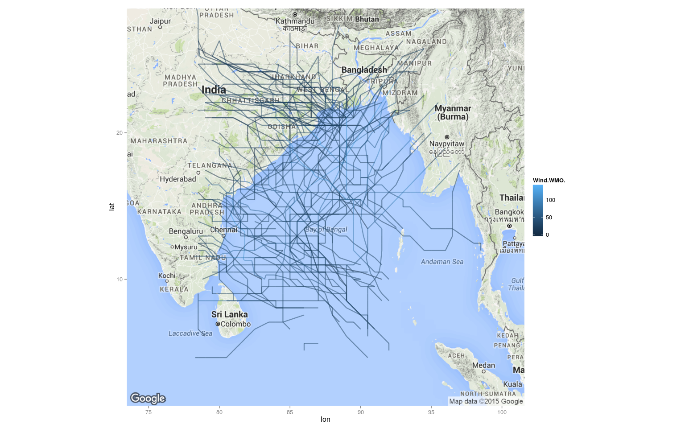
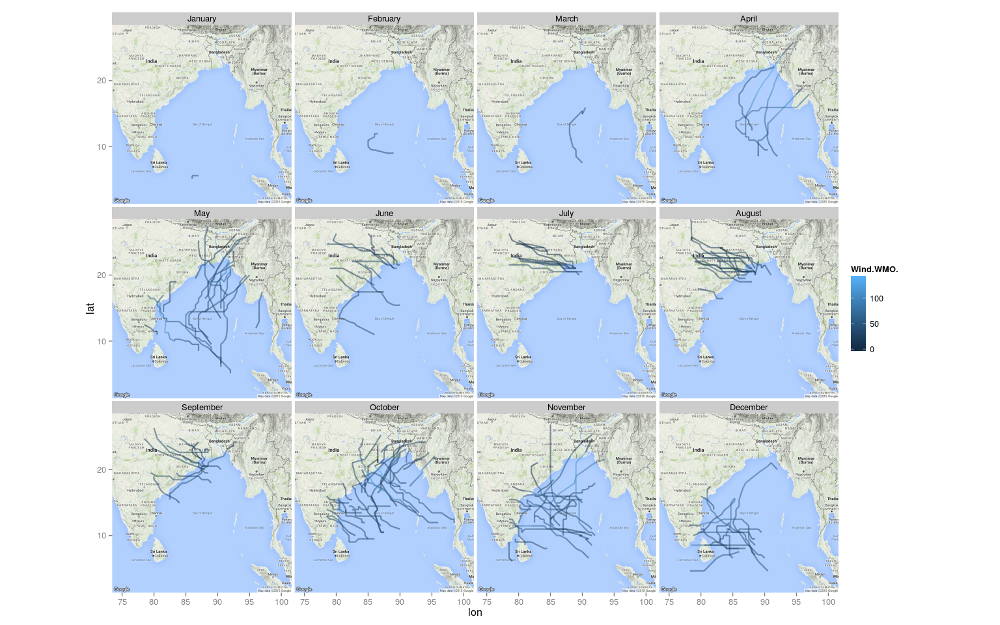
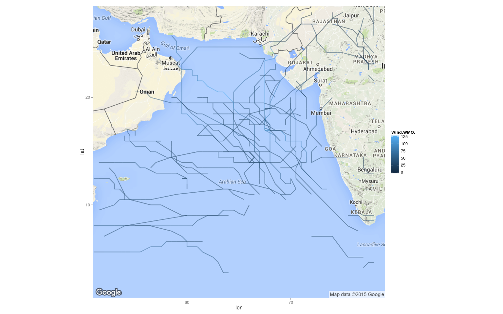

# Visualizing trajectories of Cyclones in Indian Ocean Basin
Sainath Adapa  
August 13th, 2015  

Thanks to Gaston Sanchez for a very informative Rpub, [Visualizing Hurricane Trajectories](http://rpubs.com/gaston/hurricanes). 
I have reused most of his preprocessing code in this script.
Source code is at [github.com/sainathadapa](https://github.com/sainathadapa/Scripts/tree/master/plotting-cyclones).

# Preprocessing


```r
# Loading storms data for North Indian Ocean Basin
stormsData <- read.csv(
  url('ftp://eclipse.ncdc.noaa.gov/pub/ibtracs/v03r06/wmo/csv/basin/Basin.NI.ibtracs_wmo.v03r06.csv'),
  skip = 1, stringsAsFactors = FALSE)

# remove variable information
stormsData <- stormsData[-1, ]

# formatting some columns
stormsData[] <- lapply(stormsData, str_trim)
numeric_columns <- c('Season', 'Latitude', 'Longitude', 'Wind.WMO.', 'Pres.WMO.')
stormsData[numeric_columns] <- lapply(stormsData[numeric_columns], as.numeric)
stormsData$ISO_time <- as.POSIXct(stormsData$ISO_time, tz = 'Asia/Kolkata')

# Structure of the data.frame
stormsData %>% str
```

```
## 'data.frame':	3505 obs. of  16 variables:
##  $ Serial_Num          : chr  "1990124N09088" "1990124N09088" "1990124N09088" "1990124N09088" ...
##  $ Season              : num  1990 1990 1990 1990 1990 1990 1990 1990 1990 1990 ...
##  $ Num                 : chr  "02" "02" "02" "02" ...
##  $ Basin               : chr  "NI" "NI" "NI" "NI" ...
##  $ Sub_basin           : chr  "BB" "BB" "BB" "BB" ...
##  $ Name                : chr  "NOT NAMED" "NOT NAMED" "NOT NAMED" "NOT NAMED" ...
##  $ ISO_time            : POSIXct, format: "1990-05-04 00:00:00" "1990-05-04 06:00:00" ...
##  $ Nature              : chr  "NR" "NR" "NR" "NR" ...
##  $ Latitude            : num  8.5 8.5 9.5 9.5 10 10 10.1 10.3 10.3 10 ...
##  $ Longitude           : num  87 87 87 86 85.5 85 84.7 83.9 83.3 83.2 ...
##  $ Wind.WMO.           : num  16 25 25 25 30 35 45 55 55 77 ...
##  $ Pres.WMO.           : num  1006 1002 1000 1002 998 ...
##  $ Center              : chr  "newdelhi" "newdelhi" "newdelhi" "newdelhi" ...
##  $ Wind.WMO..Percentile: chr  "0.543" "1.880" "1.880" "1.880" ...
##  $ Pres.WMO..Percentile: chr  "1.386" "14.665" "27.021" "14.665" ...
##  $ Track_type          : chr  "main" "main" "main" "main" ...
```

```r
# creating an unique id for every storm
stormsData$ID <- as.factor(paste(stormsData$Season,stormsData$Num,sep = "-"))

# extracting month and converting it to a factor
stormsData %>%
  group_by(ID) %>% 
  mutate(Month = format(ISO_time[1], format = "%B")) %>% 
  ungroup %>% 
  mutate(Month = factor(Month, levels = month.name)) ->
  stormsData
```

# Cyclones of Bay of Bengal


```r
BayOfBengalMap <- get_googlemap(center = c(lon = 87.5, lat = 15), zoom = 5, 
                                size = c(640, 640), scale = 2, maptype = c("terrain"), 
                                color = "color")
```

```
## Map from URL : http://maps.googleapis.com/maps/api/staticmap?center=15,87.5&zoom=5&size=640x640&scale=2&maptype=terrain&sensor=false
```

```r
# select storms from Bay of Bengal
substorms <- subset(stormsData, Sub_basin %in% 'BB')

plot1 <- ggmap(BayOfBengalMap) + 
  geom_path(data = substorms, aes(x = Longitude, y = Latitude, group = ID, color = Wind.WMO.), linejoin = "round", alpha = 0.5, size = 0.8)

plot2 <- plot1 + facet_wrap(~Month)

suppressWarnings({print(plot1);print(plot2)})
```

  

# Arabian Sea Cyclones


```r
ArabianSeaMap <- get_googlemap(center = c(lon = 65, lat = 15), zoom = 5, 
                               size = c(640, 640), scale = 2, maptype = c("terrain"), 
                               color = "color")
```

```
## Map from URL : http://maps.googleapis.com/maps/api/staticmap?center=15,65&zoom=5&size=640x640&scale=2&maptype=terrain&sensor=false
```

```r
# select storms from Bay of Bengal
substorms <- subset(stormsData, Sub_basin %in% 'AS')

plot3 <- ggmap(ArabianSeaMap) + 
  geom_path(data = substorms, aes(x = Longitude, y = Latitude,group = ID,color = Wind.WMO.), alpha = 0.5, size = 0.8)

plot4 <- plot3 + facet_wrap(~Month)

suppressWarnings({print(plot3);print(plot4)})
```

  


---
title: "main.R"
author: "sainath"
date: "Sun Oct  4 15:21:40 2015"
---
